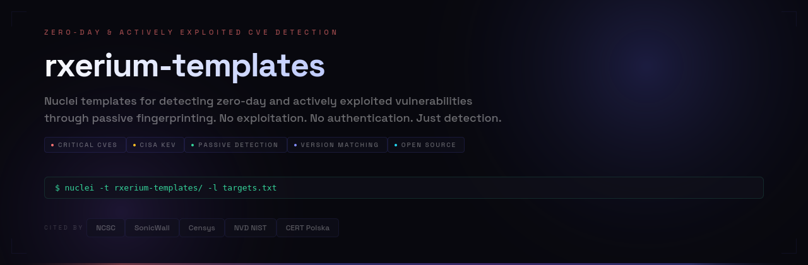

[](https://github.com/rxerium/rxerium-templates)
[](LICENSE)
[](https://github.com/rxerium/rxerium-templates)

A curated collection of **140+ Nuclei templates** focusing on **zero-day and actively exploited vulnerabilities in the wild** with a few miscellaneous templates. Templates use passive detection techniques (version/date matching) and are organized by year for easy navigation.

> ⚠️ **Note:** Date matching may be less reliable than version detection. Use with caution.

## 📊 Statistics

<!-- Stats are auto-updated by GitHub Actions -->

- **Total Templates:** 140 (139 completed, 1 WIP)
- **Coverage:** 2013-2026 | **Avg CVSS:** 8.4 | **CISA KEV:** 67
- **Severity:** Critical: 83 | High: 26 | Medium: 29 | Low: 2
- **CVSS Breakdown:** Critical (≥9.0): 65 | High (7.0-8.9): 27
- **Year Distribution:** 2013: 2 | 2016: 1 | 2017: 2 | 2018: 4 | 2019: 1 | 2020: 6 | 2021: 3 | 2022: 3 | 2023: 13 | 2024: 17 | 2025: 56 | 2026: 32


## 🚀 Quick Start

### Installation

```bash
# Clone the repository
git clone https://github.com/rxerium/rxerium-templates.git
cd rxerium-templates

# Or use directly with Nuclei
nuclei -t rxerium-templates/ -u https://target.com
```

### Examples

```bash
# Scan a single target
nuclei -t rxerium-templates/ -u https://example.com

# Scan with specific severity
nuclei -t rxerium-templates/ -u https://example.com -severity critical,high

# Scan specific year
nuclei -t rxerium-templates/2025/ -u https://example.com

# Bulk scan from file
nuclei -t rxerium-templates/ -l targets.txt
```

## 📬 Subscribe to Updates

Get notified whenever a new template is released:

**[rxerium.com/templates-feed](https://rxerium.com/templates-feed/)**

Subscribe to receive email notifications when new Nuclei templates are added to this repository.

## 📚 Resources

- **Main Nuclei Templates:** [projectdiscovery/nuclei-templates](https://github.com/projectdiscovery/nuclei-templates)
- **Nuclei Documentation:** [docs.nuclei.sh](https://docs.nuclei.sh)
- **Active exploitation intel:** [DefusedCyber](https://defusedcyber.com/) | [CISA KEV](https://www.cisa.gov/known-exploited-vulnerabilities-catalog) | [VulnCheck KEV](https://vulncheck.com/kev) | [EPSS](https://www.first.org/epss/)

## 🏆 Recognition

Templates have been cited in security research from [NCSC](https://ctoatncsc.substack.com/p/cto-at-ncsc-summary-week-ending-september-021), [SonicWall](https://www.sonicwall.com/blog/deserialization-leads-to-command-injection-in-goanywhere-mft-cve-2025-10035), [NVD NIST](https://nvd.nist.gov/vuln/detail/cve-2023-40000), [Censys](https://censys.com/advisory/cve-2025-52691), [ReSecurity](https://www.resecurity.com/blog/article/cve-2026-22794-changing-the-origin-header-to-take-over-appsmith-accounts), [California CyberSecurity Integration Center](https://www.caloes.ca.gov/wp-content/uploads/Homeland-Security/Documents/Cyber-Advisories/Cal-CSIC-CyberAdvisory-Fortras-GoAnywhere-MFT-Critical-RCE.pdf) and many others.

## ⚖️ Disclaimer

These templates are for **authorized security testing only**. Always obtain proper permission before scanning.
